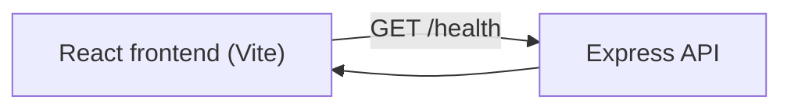

# Hackathon Project Matcher

Step 1 scaffold for the Hackathon Project Matcher web app.

[](https://github.com/swashrafiq/hackathon-project-matcher/actions/workflows/ci.yml)
[](https://github.com/swashrafiq/hackathon-project-matcher/actions/workflows/deploy.yml)

## Quick Start

```bash
npm install
npm run dev
```

Open the local URL shown by Vite to view the app.

## Available Scripts

```bash
npm run dev
npm run test
npm run lint
npm run format
npm run build
npm run audit:ci
npm run preview
```

## CI

- Workflow file: `.github/workflows/ci.yml`
- Triggered on pushes to `dev`/`main` and pull requests targeting `dev`/`main`
- Runs: install, lint, test, build, dependency audit

After you push this repository to GitHub, check the **Actions** tab to confirm the first run passes.

## Branching and Staging Workflow

Use this promotion path to avoid direct changes on `main`:

1. Create a feature branch from `dev` (example: `feature/project-cards`).
2. Open PR: `feature/*` -> `dev` for integration testing/review.
3. After validation on `dev`, open PR: `dev` -> `main` for release.
4. `main` remains the production branch (Deploy workflow runs from `main`).

Suggested commands:

```bash
git checkout dev
git pull
git checkout -b feature/short-task-name
```

Before creating a PR or commit, do a local preview + validation pass:

```bash
npm run dev
npm run test
npm run lint
npm run build
```

## Deployment (GitHub Pages)

- Workflow file: `.github/workflows/deploy.yml`
- Trigger: push to `main` (or manual dispatch)
- Live URL: [https://swashrafiq.github.io/hackathon-project-matcher/](https://swashrafiq.github.io/hackathon-project-matcher/)

### Smoke Checklist

- Deployed page loads successfully over HTTPS.
- "Hello Hackathon Project Matcher" is visible.
- Browser console has no blocking runtime errors.

### Rollback Basics

- Revert the breaking commit on `main` and push again; the deploy workflow publishes the previous stable state.
- Alternative: redeploy a known-good commit by checking it out, cherry-picking as needed, and pushing to `main`.

## UI Structure and Routes

Current shell structure:

- `header`: brand and primary navigation
- `main`: route content area
- `footer`: event context text

Current route map:

- `/` -> Home view (hello and step progress text)
- `/projects/:projectId` -> Project details placeholder view
- `*` -> Not found text fallback

## Theming

- Supported modes: `light` and `dark`
- Toggle location: app header (`Dark mode` / `Light mode` button)
- Persistence: `localStorage` key `hpm-theme`
- Default/fallback behavior: invalid or missing storage value falls back to `light`

## Mock Data Model

Core frontend model files:

- `src/types/models.ts` defines `User` and `Project` interfaces
- `src/data/mockData.ts` stores the in-memory mocked users/projects dataset
- `src/data/mockRepository.ts` exposes typed access helpers

Model highlights:

- `User`: `id`, `name`, `email`, `role`, `mainProjectId`, `watchedProjectIds`
- `Project`: `id`, `title`, `description`, `techStack`, `leadName`, `memberCount`, `status`, `createdByUserId`, `memberIds`

## Project Cards (Mocked)

Card component:

- `src/components/ProjectCard.tsx`
- Props: `{ project: Project }`

Home list behavior:

- Loads cards from `getMockProjects()`
- Shows loading state: `Loading projects...`
- Shows empty state: `No projects available yet.`
- Each card shows title, short description, member count, status, and details link

## Project Details Flow (Mocked)

Details route behavior:

- Route: `/projects/:projectId`
- Valid id: render full details (`title`, `description`, `techStack`, `leadName`, `memberCount`, `status badge`)
- Invalid/missing id: render safe not-found state with sanitized requested id

Navigation:

- User clicks `View details` on a project card
- App routes to details page for that project id

## Participant Onboarding (Mocked Session)

- Entry fields: `name` and `email` in the app header
- Validation: name is required; email must match a basic client-side format check
- Security handling: both inputs are trimmed/sanitized before storage
- Temporary storage: `localStorage` key `hpm-participant-session`
- Blocking rule: project actions stay disabled until entry succeeds

Known limitations in this step:

- Session is frontend-only (no backend identity verification yet)
- "Join project" remains mocked and non-persistent until membership API steps
- Local storage can be cleared manually by the user/browser at any time

## Backend Scaffold (Step 10)

Backend runtime:

- Stack: Node.js + Express (`backend/app.ts`, `backend/server.ts`)
- Health endpoint: `GET /health`
- Default local API URL: `http://127.0.0.1:8787`

Security baseline:

- `helmet` enabled for basic HTTP security headers
- CORS allowlist with `CORS_ORIGINS` env var (comma-separated origins)
- `x-powered-by` header disabled

Frontend connection:

- API base URL config in `src/config/runtimeConfig.ts`
- Health client smoke helper in `src/api/health.ts`

Architecture (Step 10):



Local run instructions:

```bash
# 1) Frontend
npm run dev

# 2) Backend API (separate terminal)
npm run dev:server
```

Validation commands:

```bash
npm run test
npm run lint
npm run build
```
## Environment Variables

- Copy `.env.example` to `.env.local` when adding local variables.
- Do not commit secrets.
