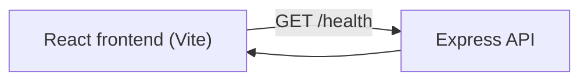

# Hackathon Project Matcher

Step 1 scaffold for the Hackathon Project Matcher web app.

[](https://github.com/swashrafiq/hackathon-project-matcher/actions/workflows/ci.yml)
[](https://github.com/swashrafiq/hackathon-project-matcher/actions/workflows/deploy.yml)

## Quick Start

```bash
npm install
npm run dev
```

Open the local URL shown by Vite to view the app.

## Available Scripts

```bash
npm run dev
npm run dev:server
npm run db:migrate
npm run db:seed
npm run test
npm run test:db
npm run lint
npm run format
npm run build
npm run audit:ci
npm run preview
```

## CI

- Workflow file: `.github/workflows/ci.yml`
- Triggered on pushes to `dev`/`main` and pull requests targeting `dev`/`main`
- Runs: install, lint, test, build, dependency audit

After you push this repository to GitHub, check the **Actions** tab to confirm the first run passes.

## Branching and Staging Workflow

Use this promotion path to avoid direct changes on `main`:

1. Create a feature branch from `dev` (example: `feature/project-cards`).
2. Open PR: `feature/*` -> `dev` for integration testing/review.
3. After validation on `dev`, open PR: `dev` -> `main` for release.
4. `main` remains the production branch (Deploy workflow runs from `main`).

Suggested commands:

```bash
git checkout dev
git pull
git checkout -b feature/short-task-name
```

Before creating a PR or commit, do a local preview + validation pass:

```bash
npm run dev
npm run test
npm run lint
npm run build
```

## Deployment (GitHub Pages)

- Workflow file: `.github/workflows/deploy.yml`
- Trigger: push to `main` (or manual dispatch)
- Live URL: [https://swashrafiq.github.io/hackathon-project-matcher/](https://swashrafiq.github.io/hackathon-project-matcher/)

### Smoke Checklist

- Deployed page loads successfully over HTTPS.
- "Hello Hackathon Project Matcher" is visible.
- Browser console has no blocking runtime errors.

### Rollback Basics

- Revert the breaking commit on `main` and push again; the deploy workflow publishes the previous stable state.
- Alternative: redeploy a known-good commit by checking it out, cherry-picking as needed, and pushing to `main`.

## UI Structure and Routes

Current shell structure:

- `header`: brand and primary navigation
- `main`: route content area
- `footer`: event context text

Current route map:

- `/` -> Home view (hello and step progress text)
- `/projects/:projectId` -> Project details placeholder view
- `*` -> Not found text fallback

## Theming

- Supported modes: `light` and `dark`
- Toggle location: app header (`Dark mode` / `Light mode` button)
- Persistence: `localStorage` key `hpm-theme`
- Default/fallback behavior: invalid or missing storage value falls back to `light`

## Mock Data Model

Core frontend model files:

- `src/types/models.ts` defines `User` and `Project` interfaces
- `src/data/mockData.ts` stores the in-memory mocked users/projects dataset
- `src/data/mockRepository.ts` exposes typed access helpers

Model highlights:

- `User`: `id`, `name`, `email`, `role`, `mainProjectId`, `watchedProjectIds`
- `Project`: `id`, `title`, `description`, `techStack`, `leadName`, `memberCount`, `status`, `createdByUserId`, `memberIds`

## Project Cards (Mocked)

Card component:

- `src/components/ProjectCard.tsx`
- Props: `{ project: Project }`

Home list behavior:

- Loads cards from `getMockProjects()`
- Shows loading state: `Loading projects...`
- Shows empty state: `No projects available yet.`
- Each card shows title, short description, member count, status, and details link

## Project Details Flow (Mocked)

Details route behavior:

- Route: `/projects/:projectId`
- Valid id: render full details (`title`, `description`, `techStack`, `leadName`, `memberCount`, `status badge`)
- Invalid/missing id: render safe not-found state with sanitized requested id

Navigation:

- User clicks `View details` on a project card
- App routes to details page for that project id

## Participant Onboarding (Mocked Session)

- Entry fields: `name` and `email` in the app header
- Validation: name is required; email must match a basic client-side format check
- Security handling: both inputs are trimmed/sanitized before storage
- Temporary storage: `localStorage` key `hpm-participant-session`
- Blocking rule: project actions stay disabled until entry succeeds

Known limitations in this step:

- Session is frontend-only (no backend identity verification yet)
- Join behavior is handled by Step 14 backend API rules
- Local storage can be cleared manually by the user/browser at any time

## Backend Scaffold (Step 10)

Backend runtime:

- Stack: Node.js + Express (`backend/app.ts`, `backend/server.ts`)
- Health endpoint: `GET /health`
- Default local API URL: `http://127.0.0.1:8787`

Security baseline:

- `helmet` enabled for basic HTTP security headers
- CORS allowlist with `CORS_ORIGINS` env var (comma-separated origins)
- `x-powered-by` header disabled

Frontend connection:

- API base URL config in `src/config/runtimeConfig.ts`
- Health client smoke helper in `src/api/health.ts`

Architecture (Step 10):



Local run instructions:

```bash
# 1) Frontend
npm run dev

# 2) Backend API (separate terminal)
npm run dev:server
```

Validation commands:

```bash
npm run test
npm run lint
npm run build
```

## Database Setup and Migrations (Step 11)

Database stack and tooling:

- Engine: SQLite via Node's built-in `node:sqlite`
- Migration runner: `backend/db/migrate.ts`
- Seed runner: `backend/db/seed.ts`
- Migration files: `backend/db/migrations/*.sql`

Schema notes:

- `users` table: participant/admin identity records (`email` is unique)
- `projects` table: project metadata with `member_count` constrained to 0..5
- `projects.created_by_user_id` references `users.id`

Migration and seed commands:

```bash
npm run db:migrate
npm run db:seed
```

CI/automation coverage:

- `npm run test:db` validates migrations apply and seed data inserts
- The CI workflow runs `test:db` before build

Security note:

- Database writes and reads use parameterized statements (`?` placeholders) to reduce SQL injection risk.

## Project Read API Endpoints (Step 12)

Implemented backend read routes:

- `GET /projects` -> returns a list under `{ projects: [...] }`
- `GET /projects/:projectId` -> returns a single project under `{ project: {...} }`

Response field scope (intentionally limited):

- `id`, `title`, `description`, `techStack`, `leadName`, `memberCount`, `status`

Security behavior:

- `projectId` format is validated server-side (rejects unsafe/invalid ids with `400`)
- Missing records return `404`
- Route handlers only expose read-model fields required by the UI

Frontend integration notes:

- `HomePage` now fetches project list from API and keeps loading/empty/error states
- `ProjectDetailsPage` now fetches project details by id and handles loading/error/not-found states

## Participant Lifecycle API (Step 13)

Participant endpoint:

- `POST /participants` with JSON body `{ name, email }`
- Behavior:
  - returns `201` + `{ source: "created" }` for new participant
  - returns `200` + `{ source: "existing" }` when email already exists
- Participant records are stored with default role `participant`

Security behavior:

- backend validates/sanitizes `name` and `email`
- basic in-memory rate limiting protects participant creation endpoint
- SQL operations use parameterized statements

Frontend flow:

- onboarding form in `App` submits to backend instead of local-only mock creation
- session now stores backend participant identity (`id`, `role`, `mainProjectId`)
- backend validation/rate-limit messages are surfaced in entry form error state

## Join Project API (Step 14)

Join endpoint:

- `POST /projects/:projectId/join` with JSON body `{ participantId }`
- Behavior:
  - returns `200` + `{ source: "joined" }` when the user joins a project for the first time
  - returns `200` + `{ source: "already_joined" }` when user is already on that same project
  - returns `409` when user already has a different `mainProjectId`

Error and validation codes:

- `400` for invalid `projectId` or `participantId` format
- `404` if target project or participant does not exist
- `409` for single-main-project rule conflict

Security behavior:

- one-main-project rule is enforced server-side in repository logic
- project membership updates happen through backend-only controlled SQL updates
- SQL operations remain parameterized

Frontend integration:

- Home page Join button now calls backend join API
- Join feedback and conflict error messages are shown in UI
- Session `mainProjectId` is updated in state and local storage from API response

## Capacity Enforcement (Step 15)

Join capacity rule:

- max members per project is 5
- join/switch attempts use an atomic guarded update (`member_count < 5`) to prevent overfill
- when full, backend returns `409` with `Project is full.`

Frontend behavior:

- Join and Switch actions are disabled when the target project reaches 5 members
- card helper text clearly shows `Project is full (max 5 members).`

## Leave Main Project (Step 16)

Leave endpoint:

- `POST /projects/:projectId/leave` with JSON body `{ participantId }`
- returns `200` + `{ source: "left" }` on success
- returns `409` if participant tries leaving a project that is not their current main project

Flow behavior:

- backend decrements the current project's `member_count` and clears user `mainProjectId` in one transaction
- frontend shows `Give up current project` action on the current main project card

## Switch Main Project (Step 17)

Switch endpoint:

- `POST /projects/:projectId/switch` with JSON body `{ participantId }`
- returns `200` + `{ source: "switched" }` on success
- returns `409` when target project is full

Transactional behavior:

- switch executes leave-old + join-new atomically
- if join-new fails (for example target full), transaction rolls back and the user keeps the old main project

Frontend behavior:

- when user already has a main project, non-main cards show `Switch to this project`
- successful switch updates session `mainProjectId` and refreshes project counters

## Environment Variables

- Copy `.env.example` to `.env.local` when adding local variables.
- Do not commit secrets.
